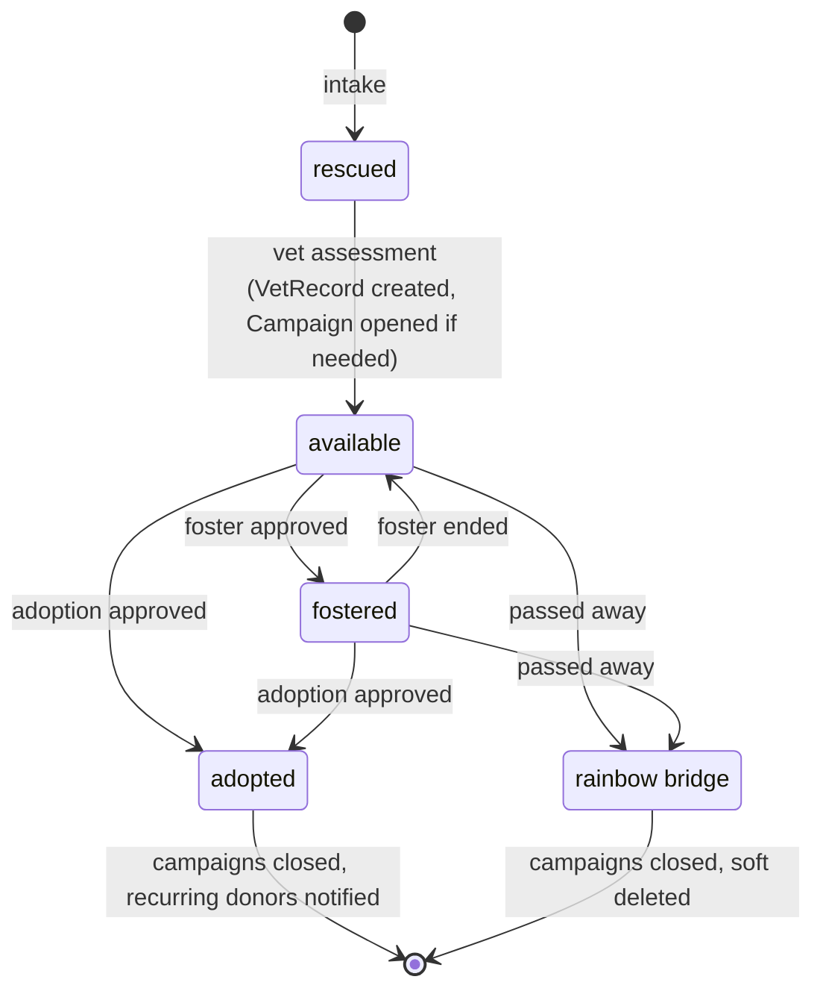

# BetterWag — Dog Shelter Donation Platform

A Laravel + Inertia SPA for dog shelters to run fundraising campaigns.
Accepts one-time emergency donations and recurring monthly sponsorships via Stripe.

---

## Tech Stack

```
Backend:    Laravel 13
Auth:       Laravel Fortify (session-based)
Payments:   Laravel Cashier + Stripe
Email:      AWS SES via Laravel Mail
Storage:    AWS S3 via Laravel Storage
Queue:      Redis
DB:         PostgreSQL
Frontend:   Vue 3 + Inertia v3 + Tailwind CSS v4
Testing:    Pest
```

---

## Local Setup

```bash
composer run setup   # install deps, generate app key, run migrations
composer run dev     # start server, queue, logs, and Vite concurrently
```

Required environment variables — see `.env.example` for the full list. Key ones:

```
STRIPE_KEY=
STRIPE_SECRET=
STRIPE_WEBHOOK_SECRET=
AWS_ACCESS_KEY_ID=
AWS_SECRET_ACCESS_KEY=
AWS_DEFAULT_REGION=
AWS_BUCKET=
MAIL_FROM_ADDRESS=
```

---

## Domain Overview

```
Shelter
├── has many Dogs
├── has many Campaigns
└── has many Staff (shelter_admin users)

Dog
├── belongs to Shelter
├── has one active Campaign
├── has many VetRecords
├── has many Photos
├── has many AdoptionApplications
└── has many FosterApplications

Campaign
├── belongs to Dog
├── belongs to Shelter
├── has many Donations
├── type: recurring | one_off
└── status: active | goal_reached | closed | cancelled

Donation
├── belongs to Campaign
├── belongs to User (donor)
├── type: one_time | recurring
└── status: pending | paid | failed | refunded

User
├── role: donor | shelter_admin | super_admin
├── has many Donations
├── has many AdoptionApplications
└── has many FosterApplications

AdoptionApplication
├── belongs to Dog
├── belongs to User
└── status: pending | approved | rejected

FosterApplication
├── belongs to Dog
├── belongs to User
└── status: pending | approved | rejected | ended

VetRecord
└── belongs to Dog

Photo
├── belongs to Dog (S3 via Laravel Storage)
└── is_primary: boolean
```

---

## Dog Lifecycle



---

## Campaign Types

### Recurring — Food & Upkeep

- Monthly sponsorship per dog
- No hard goal (ongoing)
- Closes when dog is adopted or passes away
- Donor charged monthly via Stripe subscription

### One-off — Emergency

- Hard goal amount (e.g. ₱15,000 for surgery)
- Closes when goal reached or manually by admin
- Single charge
- Examples: hit by car, surgery, rescue transport, spay/neuter drive

---

## Database Design

### shelters

| column      | type            | notes |
| ----------- | --------------- | ----- |
| id          | bigint PK       |       |
| name        | string          |       |
| email       | string unique   |       |
| location    | string nullable |       |
| description | text nullable   |       |
| timestamps  |                 |       |

### users

| column        | type               | notes                             |
| ------------- | ------------------ | --------------------------------- |
| id            | bigint PK          |                                   |
| shelter_id    | FK nullable        | null if donor                     |
| name          | string             |                                   |
| email         | string unique      |                                   |
| password      | string             |                                   |
| role          | enum               | donor, shelter_admin, super_admin |
| stripe_id     | string nullable    | Cashier                           |
| pm_type       | string nullable    | Cashier                           |
| pm_last_four  | string nullable    | Cashier                           |
| trial_ends_at | timestamp nullable | Cashier                           |
| timestamps    |                    |                                   |

### dogs

| column      | type                  | notes                                                 |
| ----------- | --------------------- | ----------------------------------------------------- |
| id          | bigint PK             |                                                       |
| shelter_id  | FK                    |                                                       |
| name        | string                |                                                       |
| breed       | string nullable       |                                                       |
| age_years   | tinyint nullable      |                                                       |
| gender      | enum                  | male, female, unknown                                 |
| description | text nullable         |                                                       |
| status      | enum                  | rescued, available, fostered, adopted, rainbow_bridge |
| is_urgent   | boolean default false | bumps to top of listing                               |
| rescued_at  | date nullable         |                                                       |
| deleted_at  | timestamp nullable    | soft delete                                           |
| timestamps  |                       |                                                       |

### campaigns

| column        | type               | notes                                   |
| ------------- | ------------------ | --------------------------------------- |
| id            | bigint PK          |                                         |
| shelter_id    | FK                 |                                         |
| dog_id        | FK                 |                                         |
| title         | string             |                                         |
| description   | text nullable      |                                         |
| type          | enum               | recurring, one_off                      |
| status        | enum               | active, goal_reached, closed, cancelled |
| goal_amount   | integer nullable   | centavos, one_off only                  |
| amount_raised | integer default 0  | centavos                                |
| closed_at     | timestamp nullable |                                         |
| timestamps    |                    |                                         |

### donations

| column                   | type               | notes                           |
| ------------------------ | ------------------ | ------------------------------- |
| id                       | bigint PK          |                                 |
| campaign_id              | FK                 |                                 |
| user_id                  | FK                 |                                 |
| type                     | enum               | one_time, recurring             |
| amount                   | integer            | centavos                        |
| status                   | enum               | pending, paid, failed, refunded |
| stripe_payment_intent_id | string nullable    |                                 |
| stripe_subscription_id   | string nullable    | recurring only                  |
| paid_at                  | timestamp nullable |                                 |
| timestamps               |                    |                                 |

### adoption_applications

| column      | type               | notes                       |
| ----------- | ------------------ | --------------------------- |
| id          | bigint PK          |                             |
| dog_id      | FK                 |                             |
| user_id     | FK                 |                             |
| status      | enum               | pending, approved, rejected |
| message     | text nullable      | why they want to adopt      |
| reviewed_at | timestamp nullable |                             |
| timestamps  |                    |                             |

### foster_applications

| column       | type               | notes                              |
| ------------ | ------------------ | ---------------------------------- |
| id           | bigint PK          |                                    |
| dog_id       | FK                 |                                    |
| user_id      | FK                 |                                    |
| status       | enum               | pending, approved, rejected, ended |
| message      | text nullable      |                                    |
| foster_start | date nullable      |                                    |
| foster_end   | date nullable      |                                    |
| reviewed_at  | timestamp nullable |                                    |
| timestamps   |                    |                                    |

### vet_records

| column      | type             | notes                                 |
| ----------- | ---------------- | ------------------------------------- |
| id          | bigint PK        |                                       |
| dog_id      | FK               |                                       |
| title       | string           | e.g. "Emergency Surgery - Hit by car" |
| notes       | text nullable    |                                       |
| cost        | integer nullable | centavos                              |
| record_date | date             |                                       |
| timestamps  |                  |                                       |

### photos

| column     | type                  | notes                               |
| ---------- | --------------------- | ----------------------------------- |
| id         | bigint PK             |                                     |
| dog_id     | FK                    |                                     |
| path       | string                | S3 path                             |
| disk       | string default 's3'   |                                     |
| is_primary | boolean default false | one primary per dog enforced in app |
| timestamps |                       |                                     |

---

## API Endpoints

These power the Inertia frontend and are available to external clients (e.g. mobile).

### Auth

```
POST   /api/register
POST   /api/login
POST   /api/logout
GET    /api/me
```

### Shelters

```
GET    /api/shelters                              public
POST   /api/shelters                              super_admin
GET    /api/shelters/{shelter}                    public
PUT    /api/shelters/{shelter}                    super_admin
```

### Dogs

```
GET    /api/dogs                                  public, urgent first, filterable by status/shelter
POST   /api/shelters/{shelter}/dogs               shelter_admin
GET    /api/dogs/{dog}                            public, with active campaign + progress
PUT    /api/dogs/{dog}                            shelter_admin
PATCH  /api/dogs/{dog}/status                     shelter_admin
DELETE /api/dogs/{dog}                            shelter_admin, soft delete
```

### Dog Photos

```
POST   /api/dogs/{dog}/photos                     shelter_admin, S3 upload
DELETE /api/dogs/{dog}/photos/{photo}             shelter_admin
PATCH  /api/dogs/{dog}/photos/{photo}/primary     shelter_admin, set as primary
```

### Campaigns

```
GET    /api/dogs/{dog}/campaigns                  public
POST   /api/dogs/{dog}/campaigns                  shelter_admin
GET    /api/campaigns/{campaign}                  public, with progress %
PATCH  /api/campaigns/{campaign}/close            shelter_admin
```

### Donations

```
POST   /api/campaigns/{campaign}/donate           authenticated donor
GET    /api/donations                             donor sees own only
GET    /api/donations/{donation}                  donor sees own only (Policy)
POST   /api/donations/{donation}/cancel-recurring donor cancels their own subscription
```

### Applications

```
POST   /api/dogs/{dog}/adopt                      authenticated donor
POST   /api/dogs/{dog}/foster                     authenticated donor
GET    /api/applications                          shelter_admin sees all, donor sees own
GET    /api/applications/{application}            Policy-gated
PATCH  /api/applications/{application}/approve    shelter_admin
PATCH  /api/applications/{application}/reject     shelter_admin
PATCH  /api/applications/{application}/end-foster shelter_admin
```

### Vet Records

```
GET    /api/dogs/{dog}/vet-records                shelter_admin only
POST   /api/dogs/{dog}/vet-records                shelter_admin only
GET    /api/dogs/{dog}/vet-records/{record}       shelter_admin only
PUT    /api/dogs/{dog}/vet-records/{record}       shelter_admin only
```

### Webhooks

```
POST   /api/webhooks/stripe                       Stripe signed webhook
```

---

## Stripe Webhook Events

```
payment_intent.succeeded          mark Donation paid, update Campaign amount_raised
payment_intent.payment_failed     mark Donation failed, notify donor
invoice.payment_succeeded         recurring donation paid, update amount_raised
invoice.payment_failed            notify donor of failed recurring charge
customer.subscription.deleted     mark recurring Donation cancelled
```

---

## Scheduled Jobs

```
ThankRecurringDonorJob            monthly — scheduled via Laravel Scheduler
```

All other jobs are dispatched on-demand from controllers or webhook handlers.

---

## Jobs (Queue)

```
SendDonationReceiptJob            email donor after successful payment
SendGoalReachedJob                notify shelter admin when one_off goal met
CloseCampaignJob                  close campaign after goal reached
ThankRecurringDonorJob            monthly thank you email
NotifyDonorsOnAdoptionJob         notify campaign donors dog was adopted
NotifyDonorsOnRainbowBridgeJob    notify campaign donors of passing
SendApplicationStatusJob          notify applicant of approval/rejection
FlagUrgentDogJob                  notify shelter admin when dog flagged urgent
ProcessPhotoUploadJob             resize/optimize photo after S3 upload
CancelDogSubscriptionsJob         cancel all recurring donations when dog adopted/passes
```

---

## Form Requests

```
RegisterRequest
CreateDogRequest
UpdateDogStatusRequest
CreateCampaignRequest
CreateDonationRequest
CreateApplicationRequest
CreateVetRecordRequest
UploadPhotoRequest
```

---

## Custom Validation Rules

```
CampaignIsActive         can't donate to closed/cancelled campaign
DogIsAvailable           can't apply to adopt/foster if already adopted
GoalNotExceeded          one_off donations can't exceed remaining goal amount
NoPendingApplication     can't submit duplicate application for same dog
```

---

## Policies

```
DogPolicy
  view:            public
  create:          shelter_admin of that shelter
  update:          shelter_admin of that shelter
  delete:          shelter_admin of that shelter

CampaignPolicy
  view:            public
  create:          shelter_admin of campaign's dog's shelter
  close:           shelter_admin only

DonationPolicy
  view:            donor sees own only
  create:          any authenticated user
  cancelRecurring: donor cancels own only

ApplicationPolicy
  view:            shelter_admin sees all, donor sees own
  approve/reject:  shelter_admin of that dog's shelter
  endFoster:       shelter_admin only
```

---

## Mail (AWS SES)

```
DonationReceiptMail
GoalReachedMail
AdoptionAnnouncementMail      to shelter + all campaign donors
RainbowBridgeMail             to shelter + all campaign donors
ApplicationApprovedMail
ApplicationRejectedMail
RecurringDonationFailedMail
MonthlyThankYouMail
```

---

## Storage (AWS S3)

```
Dog photos → s3://betterwag/dogs/{dog_id}/{uuid}.jpg
Primary photo surfaced via DogResource
ProcessPhotoUploadJob handles resize/optimize after upload
```

---

## Planned Frontend

Vue 3 + Quasar (as Vite plugin) — not yet implemented, backend is the priority.
Setup reference: https://quasar.dev/start/vite-plugin/
